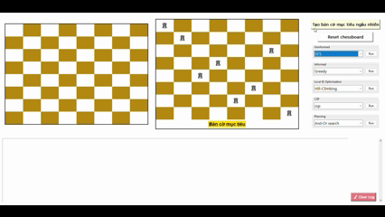
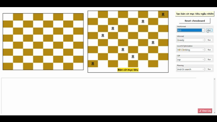
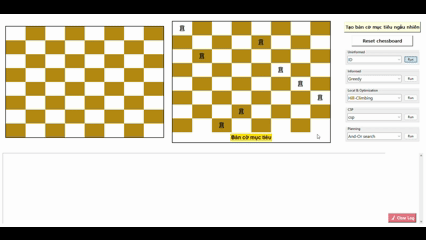
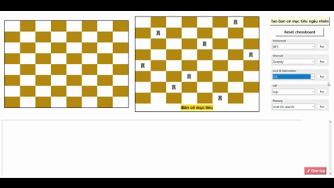
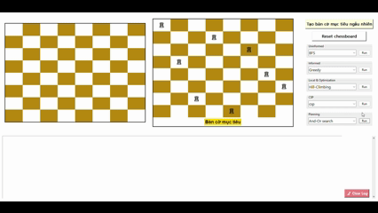

* CÁC THUẬT TOÁN TÌM KIẾM TRONG AI

I. Nhóm thuật toán tìm kiếm không có thông tin

1. Breadth-First Search (BFS)

-- Lý  thuyết:
* Khái niệm: tìm kiếm theo chiều rộng, duyệt từng mức của cây trạng thái từ gốc ra ngoài.  
* Cách hoạt động:
  - bắt đầu từ nút gốc, dùng hàng đợi để lưu các nút chờ mở rộng,
  - lần lượt mở rộng tất cả nút ở độ sâu 0, rồi 1, rồi 2,... cho đến khi tìm được đích.  
* Ưu điểm:
  - tìm được lời giải ngắn nhất nếu chi phí các bước đi bằng nhau,
  - đơn giản, trực quan.  
* Nhược điểm:
  - tốn nhiều bộ nhớ khi không gian trạng thái lớn.  
* Độ phức tạp:
  - thời gian: O(b^d)
  - bộ nhớ: O(b^d)
  - trong đó b là hệ số phân nhánh (branching factor), d là độ sâu của lời giải.

-- Ứng dụng trong game đặt 8 quân xe:
*Hàm bfs_rooks() thực hiện thuật toán tìm kiếm theo chiều rộng (BFS).

*Cách hoạt động:

Bắt đầu với hàng đợi chứa trạng thái rỗng [] (chưa đặt quân nào).

Mỗi vòng lặp: lấy một trạng thái ra khỏi hàng đợi, mở rộng nó bằng cách thêm 1 quân xe vào cột chưa dùng theo nguyên tắc LIFO

Mỗi trạng thái con được thêm vào hàng đợi để tiếp tục mở rộng sau.

Khi trạng thái có đủ n quân xe (mỗi hàng một quân), thuật toán dừng và trả về nghiệm.

Nếu hàng đợi rỗng mà chưa tìm thấy nghiệm, kết thúc với thông báo thất bại.

2. Depth-First Search (DFS)

-- Lý  thuyết:
* Khái niệm: tìm kiếm theo chiều sâu, đi sâu vào một nhánh cho đến khi gặp đích hoặc bế tắc.  
* Cách hoạt động:
  - dùng ngăn xếp (hoặc đệ quy) để theo dõi đường đi hiện tại,
  - mở rộng nút con đầu tiên liên tiếp; khi không thể mở rộng, quay lui (backtrack) lên nút cha.  
* Ưu điểm:
  - tốn ít bộ nhớ hơn BFS,
  - có thể tìm lời giải nhanh khi nó nằm sâu nhưng ở nhánh đầu.  
* Nhược điểm:
  - không đảm bảo tìm lời giải tối ưu,
  - có thể rơi vào vòng lặp nếu không kiểm soát.  
* Độ phức tạp:
  - thời gian: O(b^m)
  - bộ nhớ: O(b * m)
  - trong đó b là hệ số phân nhánh, m là độ sâu tối đa của cây.

-- Ứng dụng trong game đặt 8 quân xe:
*Hàm dfs_rooks() thực hiện thuật toán tìm kiếm theo chiều sâu (DFS)

*Cách hoạt động:

Khởi tạo ngăn xếp chứa trạng thái rỗng [].

Mỗi vòng lặp: lấy trạng thái ở đỉnh ngăn xếp ra (ưu tiên đi sâu nhất) theo nguyên tắc LIFO

Nếu trạng thái có đủ n quân xe thì trả về nghiệm.

Ngược lại, sinh các trạng thái con bằng cách thêm 1 quân xe vào cột chưa được dùng và đẩy chúng vào ngăn xếp.

Tiếp tục cho đến khi ngăn xếp rỗng → không tìm thấy nghiệm hợp lệ.

3. Uniform Cost Search (UCS)

-- Lý  thuyết:
* Khái niệm: tìm kiếm theo chi phí, luôn mở rộng nút có chi phí đường đi g(n) nhỏ nhất trước.  
* Cách hoạt động:
  - dùng hàng đợi ưu tiên (priority queue) sắp theo g(n),
  - khi pop một nút đích từ hàng đợi, đảm bảo đó là đường đi chi phí nhỏ nhất.  
* Ưu điểm:
  - luôn tìm được nghiệm tối ưu nếu chi phí các bước là không âm.  
* Nhược điểm:
  - có thể tốn thời gian/bộ nhớ lớn nếu không có heuristic.  
* Độ phức tạp:
  - thời gian: O(b^(1 + ⌊C*/ε⌋))
  - bộ nhớ: O(b^(1 + ⌊C*/ε⌋))
  - trong đó b là hệ số phân nhánh, C* là chi phí của lời giải tối ưu, ε là kích thước bước chi phí nhỏ nhất (minimum step cost).

-- Ứng dụng trong game đặt 8 quân xe - Hàm ucs_rooks():
Bắt đầu với hàng đợi ưu tiên chứa trạng thái rỗng [] có chi phí 0.

Mỗi vòng lặp: lấy ra trạng thái có cost nhỏ nhất trong hàng đợi để mở rộng.

Nếu trạng thái có đủ n quân xe thì trả về nghiệm cùng tổng chi phí.

Ngược lại, sinh các trạng thái con bằng cách thêm 1 quân xe vào cột chưa dùng, tính chi phí mới qua cost_function() rồi đưa vào hàng đợi ưu tiên.

Lặp lại cho đến khi tìm thấy nghiệm tối ưu hoặc hàng đợi rỗng.

4. Depth-Limited Search (DLS)

-- Lý  thuyết:
* Khái niệm: phiên bản của DFS với giới hạn độ sâu tối đa L.  
* Cách hoạt động:
  - thực hiện DFS nhưng không mở rộng các nút có độ sâu vượt quá L,
  - nếu đến độ sâu L mà chưa tìm thấy đích thì trả về failure (hoặc cut-off).  
* Ưu điểm:
  - tránh vòng lặp vô hạn khi không có kiểm tra visited, kiểm soát bộ nhớ.  
* Nhược điểm:
  - có thể bỏ sót lời giải nếu nằm sâu hơn L.  
* Độ phức tạp:
  - thời gian: O(b^L)
  - bộ nhớ: O(b * L)
  - trong đó b là hệ số phân nhánh, L là độ sâu giới hạn.

-- Ứng dụng trong game đặt 8 quân xe - Hàm dls_rooks(limit=8):
Bắt đầu từ trạng thái rỗng [], gọi hàm đệ quy dls(state, depth) để mở rộng dần từng mức.

Ở mỗi bước:

Nếu trạng thái đủ n quân xe → trả về nghiệm.

Nếu đạt độ sâu giới hạn limit → dừng mở rộng và quay lui.

Ngược lại, sinh các trạng thái con bằng cách thêm 1 quân xe vào cột chưa dùng rồi gọi đệ quy tăng độ sâu lên 1.

Quá trình tiếp tục cho đến khi tìm được nghiệm hợp lệ hoặc toàn bộ nhánh đều bị cắt do đạt giới hạn độ sâu.

5. Iterative Deepening (ID)

-- Lý  thuyết:
* Khái niệm: kết hợp ưu điểm của BFS (tối ưu theo bước) và DFS (bộ nhớ thấp) bằng cách lặp DLS với L tăng dần từ 0 tới d.  
* Cách hoạt động:
  - thực hiện DLS với L = 0, rồi L = 1, rồi L = 2,... cho đến khi tìm thấy lời giải,
  - mỗi lần lặp giống một DFS nhưng giới hạn sâu khác nhau.  
* Ưu điểm:
  - tìm được lời giải tối ưu như BFS nhưng chỉ dùng bộ nhớ như DFS.  
* Nhược điểm:
  - lặp lại nhiều lần các node ở các mức nông (tốn CPU).  
* Độ phức tạp:
  - thời gian: O(b^d)
  - bộ nhớ: O(b * d)
  - trong đó b là hệ số phân nhánh, d là độ sâu của lời giải.

-- Ứng dụng trong game đặt 8 quân xe - Hàm id_rooks():
id_rooks() là vòng điều khiển chính:

Bắt đầu từ giới hạn độ sâu limit = 1, tăng dần tới n.

Mỗi lần lặp sẽ gọi id_dfs_rooks(limit) để tìm nghiệm ở giới hạn đó.

Nếu tìm thấy nghiệm, thuật toán dừng và trả về kết quả.

Nếu không, tiếp tục tăng giới hạn và thử lại.

id_dfs_rooks(limit) là bước tìm kiếm theo chiều sâu có giới hạn:

Dùng ngăn xếp (stack) để duyệt theo DFS.

Mỗi trạng thái là danh sách vị trí quân xe đã đặt.

Khi đạt tới limit, thuật toán quay lui (backtrack).

Khi có đủ n quân, kiểm tra xem có khớp với trạng thái đích (goal_cols) bằng check_goal_state().

II. Nhóm thuật toán tìm kiếm có thông tin

1. Greedy Best-First Search

-- Lý  thuyết:
* Khái niệm: chọn mở rộng nút có heuristic h(n) nhỏ nhất — tức là nút "có vẻ" gần đích nhất.  
* Cách hoạt động:
  - dùng hàng đợi ưu tiên sắp theo h(n),
  - luôn mở rộng nút có h(n) thấp nhất, không xét g(n) (chi phí đã đi).  
* Ưu điểm:
  - nhanh trong nhiều trường hợp vì tập trung theo heuristic.  
* Nhược điểm:
  - không đảm bảo nghiệm tối ưu, dễ rơi vào bẫy heuristic (local optimum).  
* Độ phức tạp:
  - thời gian: O(b^d) (trường hợp xấu)
  - bộ nhớ: O(b^d)
  - trong đó b là hệ số phân nhánh, d là độ sâu của lời giải; hiệu năng thực tế phụ thuộc mạnh vào chất lượng hàm heuristic h(n).

-- Ứng dụng trong game đặt 8 quân xe - Hàm greedy_search_rooks():
Thuật toán xây dựng nghiệm từng bước từ trên xuống dưới (theo từng hàng).

Ở mỗi bước (ứng với một hàng), xét tất cả các cột còn trống và:

Tính cost cho việc đặt quân ở cột đó.

Chọn cột có cost nhỏ nhất (được đánh giá tốt nhất theo hàm cost_function).

Thêm vị trí được chọn vào trạng thái hiện tại (state) và loại bỏ cột đó khỏi danh sách cột còn lại.

Lặp lại cho đến khi tất cả các hàng đã được đặt quân.

2. A* Search

-- Lý  thuyết:
* Khái niệm: kết hợp giữa chi phí thực tế g(n) và heuristic h(n) bằng f(n) = g(n) + h(n) để chọn nút mở rộng.  
* Cách hoạt động:
  - dùng hàng đợi ưu tiên sắp theo f(n),
  - mở rộng nút có f(n) nhỏ nhất; với heuristic *admissible* (không đánh giá quá thấp) thì A* tìm lời giải tối ưu.  
* Ưu điểm:
  - đầy đủ và tối ưu nếu h(n) là admissible; nếu h(n) còn *consistent* thì quá trình cập nhật đơn giản hơn.  
* Nhược điểm:
  - tốn bộ nhớ vì phải lưu open/closed lists; có thể nổ bộ nhớ trên không gian lớn.  
* Độ phức tạp:
  - thời gian: O(b^d) (trường hợp xấu; thực tế phụ thuộc chất lượng h)
  - bộ nhớ: O(b^d)
  - trong đó b là hệ số phân nhánh, d là độ sâu lời giải; hiệu năng cải thiện khi h càng gần giá trị thực của chi phí còn lại.

-- Ứng dụng trong game đặt 8 quân xe - Hàm a_star_search():
Thuật toán sử dụng hàng đợi ưu tiên (priority queue) để mở rộng các trạng thái có giá trị f = g + h nhỏ nhất trước, trong đó:

g: Chi phí thực tế từ trạng thái ban đầu đến trạng thái hiện tại.

h: Giá trị heuristic (ước lượng chi phí còn lại đến đích), tính bằng cost_function.

f: Tổng chi phí ước lượng (f = g + h).

Ban đầu, thuật toán khởi tạo với trạng thái rỗng ([]) và f = 0.

Ở mỗi vòng lặp:

Lấy ra trạng thái có f nhỏ nhất trong hàng đợi.

Nếu trạng thái này có đủ n quân thì xem là nghiệm hoàn chỉnh và trả về.

Nếu chưa đủ, thuật toán mở rộng các trạng thái con bằng cách thêm quân mới vào các cột còn trống.

Mỗi trạng thái con được tính lại f, g, h và thêm vào hàng đợi.

Các trạng thái đã được mở rộng được lưu vào tập seen để tránh lặp lại.

III. Nhóm thuật toán tìm kiếm cục bộ

1. Hill Climbing

-- Lý  thuyết:
* Khái niệm: bắt đầu từ một trạng thái ban đầu, lặp tìm trạng thái lân cận tốt hơn theo hàm mục tiêu.  
* Cách hoạt động:
  - từ trạng thái hiện tại, sinh tất cả (hoặc một số) trạng thái lân cận,
  - chọn trạng thái có giá trị tốt nhất; nếu không có trạng thái tốt hơn thì dừng (có thể local optimum).  
* Ưu điểm:
  - đơn giản, nhanh cho các bài toán có không gian lớn nhưng cục bộ mượt.  
* Nhược điểm:
  - dễ kẹt ở cực trị địa phương, plateaus, hoặc rời local optimum.  
* Độ phức tạp:
  - thời gian: O(i * b)
  - bộ nhớ: O(n)
  - trong đó i là số vòng lặp (iterations), b là số lân cận mỗi bước, n là kích thước lưu trạng thái (hoặc kích thước input).

-- Ứng dụng trong game đặt 8 quân xe - Hàm hill_climbing():
Bắt đầu bằng việc khởi tạo ngẫu nhiên một trạng thái ban đầu state (vị trí các quân xe).

Tính cost hiện tại (cur_cost) dựa trên hàm cost_function — giá trị càng nhỏ thì trạng thái càng tốt.

Trong mỗi vòng lặp:

Sinh ra tất cả các trạng thái lân cận (neighbors) bằng cách hoán đổi vị trí giữa hai quân xe (get_neighbors).

Tính cost cho từng neighbor, chọn neighbor có cost nhỏ nhất.

Nếu cost của neighbor tốt hơn cost hiện tại → di chuyển lên (leo lên đồi), cập nhật trạng thái.

Nếu không còn neighbor nào tốt hơn → dừng lại tại cực trị cục bộ.

2. Simulated Annealing

-- Lý  thuyết:
* Khái niệm: mở rộng hill climbing bằng cách cho phép chấp nhận các bước xấu với xác suất giảm dần (theo "nhiệt độ") để thoát local optimum.  
* Cách hoạt động:
  - tại mỗi bước, chọn ngẫu nhiên một trạng thái lân cận,
  - nếu tốt hơn thì chấp nhận; nếu xấu hơn thì chấp nhận với xác suất e^{-Δ/T}, giảm dần T theo lịch (schedule).  
* Ưu điểm:
  - có thể thoát local optimum và tìm gần tới global optimum nếu lịch giảm nhiệt hợp lý.  
* Nhược điểm:
  - cần tinh chỉnh lịch nhiệt độ và số bước; chậm nếu muốn đảm bảo chất lượng tốt.  
* Độ phức tạp:
  - thời gian: O(i * b)
  - bộ nhớ: O(n)
  - trong đó i là số vòng lặp, b là số lân cận, n là kích thước trạng thái.

-- Ứng dụng trong game đặt 8 quân xe - Hàm simulated_annealing():
Khởi tạo nhiệt độ ban đầu T, nhiệt độ tối thiểu T_min và hệ số làm nguội alpha (0 < alpha < 1).

Sinh ngẫu nhiên trạng thái ban đầu state và tính cost hiện tại (cur_cost) bằng hàm heuristic_conflict.

Hàm heuristic_conflict được tính theo tiêu chí: cứ 1 cặp cột trùng nhau thì +1

Trong mỗi vòng lặp:

Sinh neighbor mới bằng cách thay đổi ngẫu nhiên vị trí của một quân.

Tính chênh lệch cost: Δ = new_cost - cur_cost.

Nếu Δ ≤ 0 (tức là nghiệm mới tốt hơn) → chấp nhận ngay.

Nếu Δ > 0 (tức là nghiệm tệ hơn), chấp nhận có xác suất P = e^(-Δ / T), cho phép “nhảy thoát” khỏi cực trị cục bộ.

Sau mỗi bước, giảm nhiệt độ: T *= alpha.

Dừng lại khi T < T_min hoặc tìm thấy nghiệm thỏa mãn điều kiện mục tiêu.

3. Beam Search

-- Lý  thuyết:
* Khái niệm: giữ lại tối đa k trạng thái tốt nhất (beam width) ở mỗi bước, thay vì giữ toàn bộ frontier.  
* Cách hoạt động:
  - từ k trạng thái hiện tại, sinh tất cả con của chúng,
  - chọn k trạng thái tốt nhất trong số đó làm trạng thái cho bước tiếp theo.  
* Ưu điểm:
  - tiết kiệm bộ nhớ hơn tìm kiếm toàn diện; nhanh hơn khi k nhỏ.  
* Nhược điểm:
  - không đảm bảo tìm lời giải tối ưu; nếu k quá nhỏ dễ mất nghiệm tốt.  
* Độ phức tạp:
  - thời gian: O(k * b * d)
  - bộ nhớ: O(k * d)
  - trong đó k là beam width, b là hệ số phân nhánh, d là độ sâu (số bước cần tìm).

-- Ứng dụng trong game đặt 8 quân xe - Hàm beam_search():
Khởi tạo beam ban đầu gồm 1 trạng thái rỗng (0, []).

Với mỗi hàng trên bàn cờ:

Mở rộng tất cả các trạng thái trong beam hiện tại để sinh ra các candidate mới bằng cách thêm một cột khả thi.

Tính cost (h) cho từng candidate bằng hàm cost_function.

Chọn ra k trạng thái có cost nhỏ nhất (tốt nhất) để tạo thành beam cho bước kế tiếp.

Ghi log thông tin về các trạng thái được giữ lại.

Khi đã mở rộng hết n hàng hoặc không còn candidate hợp lệ, chọn trạng thái tốt nhất cuối cùng trong beam làm kết quả.

4. Genetic Algorithm

-- Lý  thuyết:
* Khái niệm: thuật toán tiến hóa dùng quần thể các cá thể, áp dụng chọn lọc, lai ghép, và đột biến để tiến đến nghiệm tốt.  
* Cách hoạt động:
  - khởi tạo quần thể kích thước P,
  - lặp: đánh giá fitness, chọn cá thể, lai ghép để tạo thế hệ mới, áp dụng đột biến, lặp G thế hệ.  
* Ưu điểm:
  - mạnh với không gian tìm kiếm lớn và đa cực trị, dễ song song hóa.  
* Nhược điểm:
  - nhiều siêu tham số cần tinh chỉnh; không đảm bảo tối ưu toàn cục.  
* Độ phức tạp:
  - thời gian: O(P * G * L)
  - bộ nhớ: O(P * L)
  - trong đó P là kích thước quần thể (population), G là số thế hệ (generations), L là chi phí đánh giá một cá thể (length / evaluation cost).

-- Ứng dụng trong game đặt 8 quân xe - Hàm genetic_algorithm():
*Khởi tạo quần thể ban đầu:

    Tạo ra population_size cá thể, mỗi cá thể là một chuỗi 8 gen (vị trí của 8 quân hậu).

    Tính độ thích nghi (fitness) của từng cá thể bằng hàm heuristic_conflict().

Tiến hóa qua từng thế hệ:

Với mỗi thế hệ từ 1 đến max_generations:

    Kiểm tra xem có cá thể nào đạt nghiệm hoàn hảo (cost = 0) hay chưa → nếu có thì dừng.

Chọn lọc: Chọn 2 cá thể tốt nhất (bố và mẹ) dựa trên cost thấp nhất.

Lai ghép (crossover):

    Tạo ra 2 cá thể con bằng cách ghép nửa đầu của bố và nửa sau của mẹ, rồi ngược lại.

    Đánh giá và log lại cost của từng cá thể con.

    Chọn con tốt nhất: Giữ lại cá thể con có cost nhỏ hơn.

Đột biến (mutation):

    Với xác suất 10%, thay đổi ngẫu nhiên một gen trong cá thể con.

    Việc này giúp đa dạng quần thể, tránh bị kẹt trong cực tiểu cục bộ.

Tạo quần thể mới:

    Giữ lại cá thể con tốt nhất, bổ sung thêm các cá thể ngẫu nhiên mới để duy trì kích thước quần thể.

Đánh giá:

    Chọn ra cá thể tốt nhất

Kết thúc:

    Sau max_generations thế hệ, chọn cá thể có cost thấp nhất trong quần thể cuối cùng làm kết quả.

IV. Nhóm thuật toán tìm kiếm theo ràng buộc

1. Backtracking + Forward Checking

-- Lý thuyết
* Khái niệm: thử gán giá trị cho biến theo thứ tự, quay lui khi mâu thuẫn, và dùng forward checking để loại bỏ giá trị không khả thi cho các biến còn lại.  
* Cách hoạt động:
  - chọn biến chưa gán, thử từng giá trị hợp lệ, cập nhật miền (domain) các biến chưa gán bằng forward checking,
  - nếu một biến có miền rỗng thì quay lui; tiếp tục đến khi gán đủ.  
* Ưu điểm:
  - giảm đáng kể không gian tìm kiếm so với brute force.  
* Nhược điểm:
  - vẫn có thể tốn thời gian nếu ràng buộc yếu hoặc thứ tự biến xấu.  
* Độ phức tạp:
  - thời gian: O(d^n) trong trường xấu nhất
  - trong đó n là số biến, d là kích thước miền giá trị trung bình.

-- Ứng dụng trong game đặt 8 quân xe - Hàm backtracking_fc():
Khởi tạo:

    Bắt đầu với hàng đầu tiên (row = 0) và miền giá trị ban đầu cho mỗi hàng là tất cả các cột khả thi [[0, 1, ..., n-1], ...].

    Gọi hàm đệ quy forward_checking(0, [], initial_col) để bắt đầu quá trình tìm kiếm.

Đệ quy Forward Checking:

    Ở mỗi hàng row, thuật toán lần lượt thử đặt quân tại các cột khả thi trong col_available[row].

    Mỗi khi đặt một quân tại ô (row, col), thuật toán sẽ cập nhật miền giá trị (domain) của các hàng sau bằng cách loại bỏ cột vừa chọn — đây chính là forward checking.

Kiểm tra miền hợp lệ:

    Sau khi loại bỏ, nếu bất kỳ hàng nào phía dưới không còn cột khả thi, nhánh hiện tại bị loại bỏ ngay (backtrack).

    Nếu vẫn còn miền hợp lệ, thuật toán đệ quy sang hàng kế tiếp với miền giá trị đã được cập nhật.

Điều kiện dừng:

    Khi row == n, tức là đã đặt đủ n quân mà không xảy ra xung đột, thuật toán lưu nghiệm hợp lệ vào danh sách kết quả solutions.

Kết thúc:

    Nếu tồn tại ít nhất một nghiệm → trả về nghiệm đầu tiên tìm được.

    Nếu không có nghiệm nào hợp lệ → thông báo không tìm thấy lời giải.

2. AC-3 (Arc Consistency 3)

-- Lý thuyết
* Khái niệm: thuật toán đạt tính khớp cung (arc consistency) cho các ràng buộc nhị phân, loại bỏ giá trị không còn khả thi.  
* Cách hoạt động:
  - đưa tất cả cung (Xi, Xj) vào hàng đợi,
  - lặp: lấy một cung, cô lập các giá trị không có đối ứng hợp lệ và cập nhật miền; nếu thay đổi thì thêm các cung liên quan vào hàng đợi.  
* Ưu điểm:
  - tiền xử lý tốt giúp backtracking hiệu quả hơn; giảm miền giá trị sớm.  
* Độ phức tạp:
  - thời gian: O(e * d^3)
  - trong đó e là số ràng buộc (số cung), d là kích thước miền giá trị lớn nhất.

-- Ứng dụng trong game đặt 8 quân xe - Hàm and_or_search():
Khởi Tạo Miền Giá Trị:

    Gán cho mỗi biến (ứng với một hàng) một miền giá trị ban đầu domain = {r: {0, 1, ..., n-1}}.

    Tạo hàng đợi tất cả các cung (xi, xj) với xi ≠ xj, biểu diễn ràng buộc giữa các biến.

Duy Trì Tính Nhất Quán Cung (Arc Consistency):

    Lấy một cung (xi, xj) ra và gọi hàm revise() để kiểm tra xem có giá trị nào trong domain[xi] không còn phù hợp với mọi giá trị của xj không.

    Nếu có, loại bỏ những giá trị đó khỏi domain[xi].

    Nếu domain[xi] trở nên rỗng, thuật toán kết luận thất bại (không có nghiệm).

    Nếu domain[xi] bị thay đổi, thêm lại các cung (xk, xi) (với xk ≠ xi, xk ≠ xj) vào hàng đợi để duy trì tính nhất quán tiếp tục lan truyền.

    Nếu không có thay đổi, bỏ qua cung đó.

Kết Quả Sau Khi Duy Trì Nhất Quán:

    Khi hàng đợi rỗng, nghĩa là tất cả các miền đã nhất quán cung — tức mọi giá trị còn lại trong mỗi domain[xi] đều hợp lệ với các biến khác.

    Thuật toán ghi lại miền giá trị sau khi ràng buộc.

Giai Đoạn Backtracking Sau AC-3:

    Dùng backtracking để chọn cụ thể một giá trị cho mỗi biến sao cho không trùng cột.

    Với mỗi hàng r, thử lần lượt các giá trị trong domain[r].

    Nếu chọn được cột chưa dùng, đặt quân và tiếp tục sang hàng kế tiếp.

    Nếu không còn giá trị hợp lệ, quay lui (backtrack) để thử giá trị khác.

Điều Kiện Dừng Và Kết Quả:

    Nếu đã chọn được giá trị cho tất cả các hàng → tìm thấy nghiệm hợp lệ.

    Nếu không tìm được giá trị nào phù hợp → không có lời giải.

V. Nhóm thuật toán tìm kiếm phân rã

1. And-Or Search

--Lý thuyêt
* Khái niệm: mô hình cây gồm nút OR (chọn một hành động) và nút AND (phải giải quyết toàn bộ các nhánh con), phù hợp cho lập kế hoạch phân rã hoặc bài toán có cấu trúc con.  
* Cách hoạt động:
  - mở rộng theo kiểu and/or: với nút OR thử từng hành động (một trong các lựa chọn), với nút AND phải kết hợp nghiệm từ tất cả nhánh con,
  - dùng đệ quy và memoization để tránh lặp lại.  
* Độ phức tạp:
  - thời gian: thường là số mũ theo kích thước phân rã (exponential)
  - trong đó độ phức tạp phụ thuộc vào số lượng nhánh tại nút OR/AND và độ sâu phân rã.

-- Ứng dụng trong game đặt 8 quân xe - Hàm and_or_search():

Khởi tạo:
Thuật toán bắt đầu từ trạng thái rỗng (chưa đặt quân nào) và gọi hàm or_search([], []).
    Mục tiêu là tìm một kế hoạch (plan) — tức chuỗi hành động — dẫn tới trạng thái đích (goal).

*Hàm OR-SEARCH:

Đại diện cho một nút OR — tức là ta có nhiều lựa chọn hành động có thể thực hiện.

Với mỗi hành động khả thi (ví dụ: chọn một cột để đặt quân ở hàng hiện tại), thuật toán sẽ:

    Sinh ra trạng thái mới bằng results(state, action).

    Gọi and_search(...) để kiểm tra xem tất cả hệ quả của hành động đó có thể dẫn tới goal không.

Nếu ít nhất một hành động dẫn đến thành công → trả về kế hoạch tương ứng.

Nếu không hành động nào thành công → trả về None.

*Hàm AND-SEARCH:

Đại diện cho một nút AND — nghĩa là tất cả các trạng thái con phải thành công.

Với mỗi trạng thái con sinh ra, thuật toán gọi lại OR-SEARCH để kiểm tra xem có thể đạt được goal không.

Nếu bất kỳ trạng thái con nào thất bại, toàn bộ AND node đó cũng thất bại.

Nếu tất cả đều thành công, kết hợp các kế hoạch con lại và trả về.

*Điều kiện dừng:

Nếu đạt được goal state → trả về kế hoạch rỗng [] (đã hoàn thành).

Nếu phát hiện vòng lặp (trạng thái đã xuất hiện trong đường đi hiện tại) → bỏ qua nhánh đó để tránh lặp vô tận.

*Kết thúc:

Nếu có ít nhất một kế hoạch hợp lệ → in ra kế hoạch hoàn chỉnh.

Nếu không có kế hoạch nào dẫn đến goal → thông báo không tìm thấy lời giải.

VI. Nhóm thuật toán tìm kiếm trong môi trường không quan sát được

1. Belief Search

-- Lý thuyết
* Khái niệm: tìm kiếm trong không gian niềm tin (belief states), mỗi belief là một tập các trạng thái vật lý có thể xảy ra.  
* Cách hoạt động:
  - đại diện niềm tin hiện tại (set hoặc phân phối), mở rộng niềm tin theo các hành động và mẫu quan sát (update belief),
  - tìm chuỗi hành động tối ưu trong không gian niềm tin thay vì không gian trạng thái vật lý.  
* Ưu điểm:
  - cho phép ra quyết định khi môi trường không quan sát hoàn toàn hoặc có sai số cảm biến.  
* Nhược điểm:
  - không gian belief thường rất lớn, tính toán nặng.  
* Độ phức tạp:
  - thời gian: tăng theo lũy thừa của số trạng thái khả dĩ trong không gian belief
  - trong đó kích thước không gian belief phụ thuộc số trạng thái vật lý |S| và chiều sâu kế hoạch t, thường dẫn đến O(|S|^t) trong trường xấu.

-- Ứng dụng trong game đặt 8 quân xe - Hàm belief_search():
Khởi tạo trạng thái niềm tin ban đầu:

    Mỗi hàng đều có tất cả các cột khả thi [0..n-1], chưa có ràng buộc nào được áp dụng.

Bắt đầu tìm kiếm đệ quy từ hàng đầu tiên:

    Tại mỗi hàng, thuật toán thử đặt quân vào từng cột khả thi trong danh sách của hàng đó.

    Mỗi lần đặt quân, thuật toán cập nhật lại danh sách cột khả thi của các hàng phía dưới bằng cách loại bỏ cột vừa được chọn (vì đã bị chiếm).

    Sau đó, đệ quy sang hàng kế tiếp với danh sách khả năng mới được cập nhật.

Khi đạt tới hàng cuối cùng (row = n):

    Lưu lại lời giải hiện tại, được xem như một belief state hợp lệ.

Sau khi duyệt hết tất cả khả năng:

    Thuật toán tổng hợp toàn bộ các belief states đã tìm được.

    Chọn ra belief state tốt nhất (trong đoạn code là trạng thái có cột đầu tiên nhỏ nhất).
    